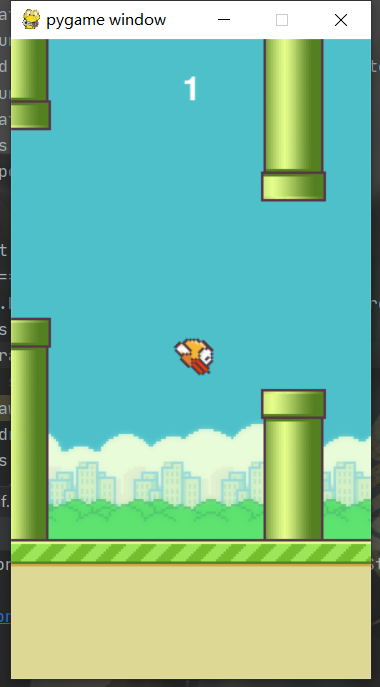
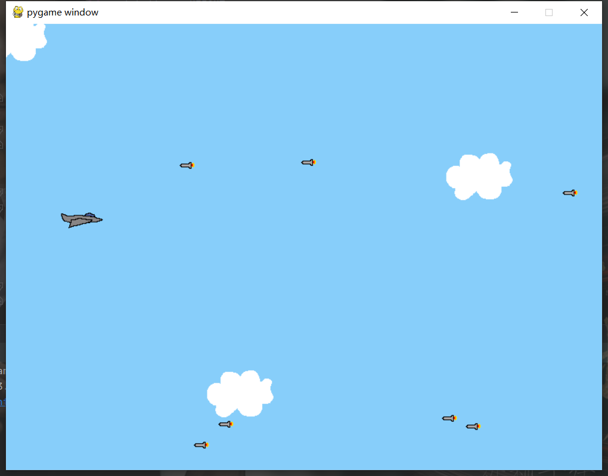
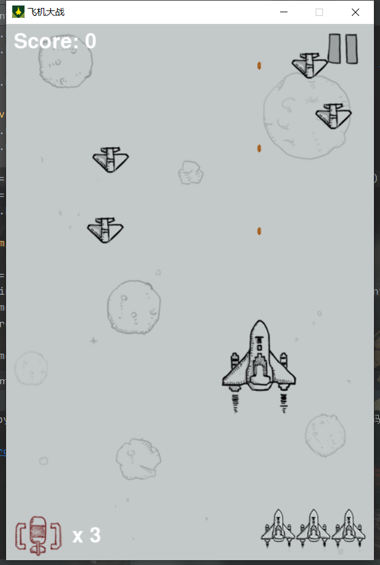

# StudyPygame
> 该仓库记录学习Pygame的一些心得

游戏有flappybird：

雷霆战机（简洁版）：

雷霆战机：

## 第一章
<<<<<<< HEAD
### [1-第一个pygame程序.py](第一章代码/1-第一个pygame程序.py)
### [2-display的基本使用.py](第一章代码/2-display的基本使用.py)
### [3-surface的基本使用.py](第一章代码/3-surface的基本使用.py)
### [4-image的基本使用.py](第一章代码/4-image的基本使用.py)
### [5-创建rect对象.py](第一章代码/5-创建rect对象.py)
### [6-rect对象的属性和方法.py](第一章代码/6-rect对象的属性和方法.py)
### [7-event事件.py](第一章代码/7-event事件.py)
### [8-draw的基本使用.py](第一章代码/8-draw的基本使用.py)
### [9-draw演示.py](第一章代码/9-draw演示.py)
=======
### [1-第一个pygame程序.py](第一章代码/1-第一个pygame程序.py)
### [2-display的基本使用.py](第一章代码/2-display的基本使用.py)
### [3-surface的基本使用.py](第一章代码/3-surface的基本使用.py)
### [4-image的基本使用.py](第一章代码/4-image的基本使用.py)
### [5-创建rect对象.py](第一章代码/5-创建rect对象.py)
### [6-rect对象的属性和方法.py](第一章代码/6-rect对象的属性和方法.py)
### [7-event事件.py](第一章代码/7-event事件.py)
### [8-draw的基本使用.py](第一章代码/8-draw的基本使用.py)
### [9-draw演示.py](第一章代码/9-draw演示.py)
>>>>>>> 53521c865629b53a3c9e0976edc7e564d8424e37
## 第三章
### [1..py](第三章代码/1..py)
### [1.精灵模块.py](第三章代码/1.精灵模块.py)
### [2.精灵组.py](第三章代码/2.精灵组.py)
### [3.collide_rect.py](第三章代码/3.collide_rect.py)
### [4.collide_circle.py](第三章代码/4.collide_circle.py)
### [5.collide_mask.py](第三章代码/5.collide_mask.py)
### [7.spritecollide.py](第三章代码/7.spritecollide.py])
## 项目
<<<<<<< HEAD
### [AircraftBattle](项目实战代码/AircraftBattle/main.py)
### [FlappyBird](项目实战代码/FlappyBird/main.py)
### [SpaceRocks](项目实战代码/SpaceRocks/main.py)
### [TopGun](项目实战代码/TopGun/main.py)
=======
### [AircraftBattle](项目实战代码/AircraftBattle/main.py)
### [FlappyBird](项目实战代码/FlappyBird/main.py)
### [SpaceRocks](项目实战代码/SpaceRocks/main.py)
### [TopGun](项目实战代码/TopGun/main.py)
>>>>>>> 53521c865629b53a3c9e0976edc7e564d8424e37
